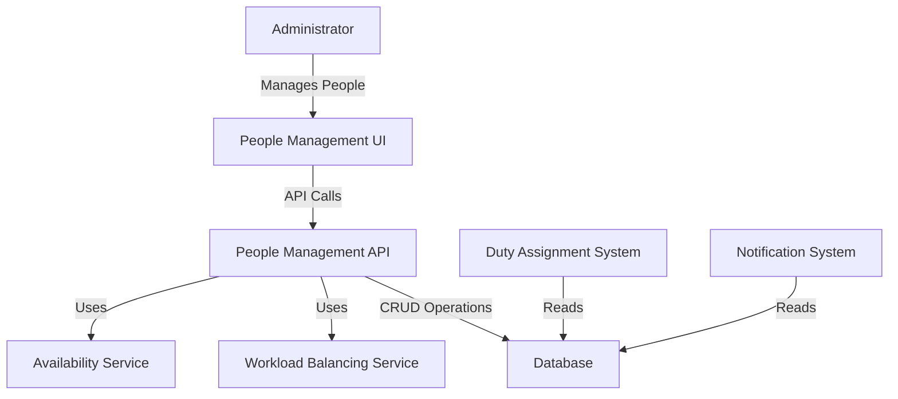
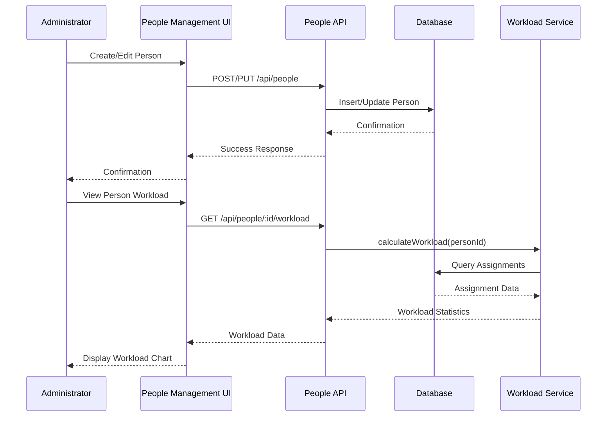
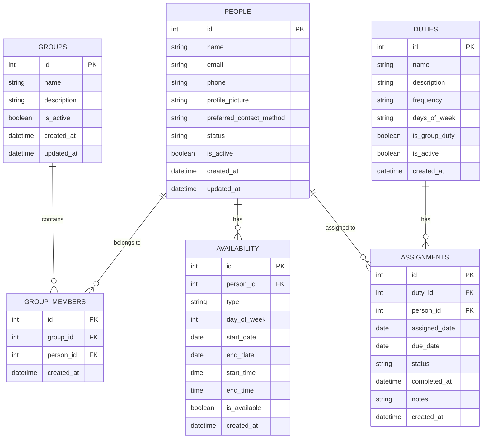

# Design Document: People Management

## Overview

The People Management feature enhances the Duty Roster application by providing comprehensive functionality to manage team members who participate in the duty roster system. This design document outlines the architecture, components, data models, and interfaces required to implement the feature according to the requirements.

The People Management feature will allow administrators to:

- Create and manage detailed profiles for team members
- Organize people into groups or teams
- Track availability and schedule preferences
- Balance workload across team members
- Import and export people data

## Architecture

The People Management feature will follow the existing application's architecture pattern, with clear separation between:

1. **Database Layer**: SQLite database with enhanced schema for people management
2. **Backend API Layer**: Express.js routes and controllers for people-related operations
3. **Frontend Components**: React components for the user interface
4. **Services Layer**: Utility services for operations like availability checking and workload balancing

### System Context Diagram



## Components and Interfaces

### Backend Components

#### 1. People API Routes (`/routes/people.js`)

Enhanced API endpoints for people management:

- `GET /api/people` - List all people with filtering options
- `GET /api/people/:id` - Get detailed person profile
- `POST /api/people` - Create new person
- `PUT /api/people/:id` - Update person details
- `DELETE /api/people/:id` - Soft-delete person
- `GET /api/people/:id/assignments` - Get person's assignments
- `GET /api/people/:id/availability` - Get person's availability
- `PUT /api/people/:id/availability` - Update person's availability
- `GET /api/people/:id/workload` - Get person's workload statistics

#### 2. Groups API Routes (`/routes/groups.js`)

New API endpoints for group management:

- `GET /api/groups` - List all groups
- `GET /api/groups/:id` - Get group details with members
- `POST /api/groups` - Create new group
- `PUT /api/groups/:id` - Update group details
- `DELETE /api/groups/:id` - Delete group
- `POST /api/groups/:id/members` - Add member to group
- `DELETE /api/groups/:id/members/:personId` - Remove member from group
- `POST /api/groups/:id/assignments` - Create assignments for all group members

#### 3. Import/Export API Routes (`/routes/import-export.js`)

New API endpoints for data import/export:

- `POST /api/import/people` - Import people data
- `GET /api/export/people` - Export people data

#### 4. Availability Service (`/services/availability.js`)

New service for managing availability:

- `checkAvailability(personId, date)` - Check if person is available on date
- `getConflicts(personId, assignmentId)` - Get conflicts for a person
- `updateAvailability(personId, availabilityData)` - Update availability

#### 5. Workload Service (`/services/workload.js`)

New service for workload balancing:

- `calculateWorkload(personId, timeframe)` - Calculate person's workload
- `getTeamWorkloadDistribution()` - Get workload distribution across team
- `suggestRebalancing()` - Suggest assignment changes for better balance

### Frontend Components

#### 1. People Management Pages

- `PeopleListPage` - Main page listing all people with filters and actions
- `PersonDetailPage` - Detailed view of person profile with tabs for different sections
- `PersonFormPage` - Form for creating/editing person details
- `GroupsPage` - Page for managing groups and memberships

#### 2. People Components

- `PeopleTable` - Sortable, filterable table of people
- `PersonCard` - Card view of person with basic info
- `PersonProfile` - Detailed profile view with all information
- `PersonForm` - Form for person details
- `AvailabilityCalendar` - Calendar for setting/viewing availability
- `WorkloadChart` - Visual representation of workload

#### 3. Group Components

- `GroupsList` - List of groups with member counts
- `GroupDetail` - Detailed view of group with member list
- `GroupForm` - Form for creating/editing groups
- `MembershipManager` - Interface for adding/removing members

#### 4. Import/Export Components

- `ImportWizard` - Step-by-step wizard for importing data
- `ExportOptions` - Form for configuring export options

### Component Interaction Diagram



## Data Models

### Enhanced Database Schema

#### 1. People Table (Enhanced)

```sql
CREATE TABLE IF NOT EXISTS people (
  id INTEGER PRIMARY KEY AUTOINCREMENT,
  name TEXT NOT NULL,
  email TEXT,
  phone TEXT,
  profile_picture TEXT,
  preferred_contact_method TEXT,
  status TEXT DEFAULT 'active', -- 'active' or 'inactive'
  is_active BOOLEAN DEFAULT 1,
  created_at DATETIME DEFAULT CURRENT_TIMESTAMP,
  updated_at DATETIME DEFAULT CURRENT_TIMESTAMP
)
```

#### 2. New Groups Table

```sql
CREATE TABLE IF NOT EXISTS groups (
  id INTEGER PRIMARY KEY AUTOINCREMENT,
  name TEXT NOT NULL,
  description TEXT,
  is_active BOOLEAN DEFAULT 1,
  created_at DATETIME DEFAULT CURRENT_TIMESTAMP,
  updated_at DATETIME DEFAULT CURRENT_TIMESTAMP
)
```

#### 3. New Group_Members Table

```sql
CREATE TABLE IF NOT EXISTS group_members (
  id INTEGER PRIMARY KEY AUTOINCREMENT,
  group_id INTEGER NOT NULL,
  person_id INTEGER NOT NULL,
  created_at DATETIME DEFAULT CURRENT_TIMESTAMP,
  FOREIGN KEY (group_id) REFERENCES groups (id),
  FOREIGN KEY (person_id) REFERENCES people (id),
  UNIQUE(group_id, person_id)
)
```

#### 4. New Availability Table

```sql
CREATE TABLE IF NOT EXISTS availability (
  id INTEGER PRIMARY KEY AUTOINCREMENT,
  person_id INTEGER NOT NULL,
  type TEXT NOT NULL, -- 'recurring' or 'temporary'
  day_of_week INTEGER, -- 0-6 for recurring availability
  start_date DATE, -- For temporary availability
  end_date DATE, -- For temporary availability
  start_time TIME,
  end_time TIME,
  is_available BOOLEAN DEFAULT 1, -- true if available, false if unavailable
  created_at DATETIME DEFAULT CURRENT_TIMESTAMP,
  FOREIGN KEY (person_id) REFERENCES people (id)
)
```

### Data Model Relationships



## Error Handling

### Error Types

1. **Validation Errors**: Returned when input data fails validation
2. **Resource Not Found**: Returned when requested resource doesn't exist
3. **Conflict Errors**: Returned when operation conflicts with existing data
4. **Permission Errors**: Returned when user lacks permission for operation
5. **Import/Export Errors**: Specific to data import/export operations

### Error Response Format

```json
{
  "error": {
    "code": "ERROR_CODE",
    "message": "Human-readable error message",
    "details": {
      "field": "Specific field with error",
      "reason": "Reason for error"
    }
  }
}
```

### Error Handling Strategy

1. **Frontend Validation**: Validate inputs before API calls
2. **Backend Validation**: Validate all inputs at API level
3. **Database Constraints**: Enforce data integrity at database level
4. **Graceful Degradation**: Provide fallback options when operations fail
5. **User Feedback**: Clear error messages with suggested actions

## Testing Strategy

### Unit Testing

1. **Backend Services**:
   - Test availability service functions
   - Test workload calculation algorithms
   - Test import/export data processing

2. **API Routes**:
   - Test all CRUD operations for people and groups
   - Test error handling and edge cases
   - Test validation logic

### Integration Testing

1. **API Integration**:
   - Test complete API flows (e.g., create person, add to group, check availability)
   - Test database interactions

2. **Service Integration**:
   - Test interaction between services (e.g., availability affecting assignments)

### Frontend Testing

1. **Component Testing**:
   - Test rendering of people components
   - Test form validation and submission
   - Test interactive elements (filters, sorts)

2. **UI Integration Testing**:
   - Test complete user flows
   - Test error handling and feedback

### End-to-End Testing

1. **Complete Workflows**:
   - Create person, add to group, set availability, assign duty
   - Import people data, verify in system
   - Delete person with future assignments, verify handling

## Implementation Considerations

### Performance Optimization

1. **Pagination**: Implement pagination for people and group listings
2. **Caching**: Cache frequently accessed data like workload statistics
3. **Indexing**: Add database indexes for frequently queried fields

### Security Considerations

1. **Input Validation**: Validate all user inputs to prevent injection attacks
2. **Data Privacy**: Ensure personal data is properly protected
3. **Access Control**: Implement proper authorization for sensitive operations

### Accessibility

1. **ARIA Attributes**: Ensure all UI components have proper ARIA attributes
2. **Keyboard Navigation**: Support keyboard navigation throughout the interface
3. **Screen Reader Support**: Test with screen readers for accessibility

### Internationalization

1. **Text Externalization**: Extract all UI text for translation
2. **Date/Time Formatting**: Support different date/time formats
3. **RTL Support**: Ensure interface works with right-to-left languages

## Future Enhancements

1. **Advanced Availability Patterns**: Support more complex availability patterns
2. **AI-Powered Workload Balancing**: Implement machine learning for optimal duty distribution
3. **Team Performance Analytics**: Add analytics for team performance and duty completion rates
4. **Integration with External Systems**: Support integration with calendar systems and HR software
