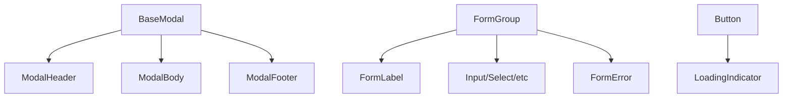

# Design Document: Reusable Components

## Overview

This design document outlines the architecture and implementation details for creating a set of reusable UI components for the Duty Roster application. The goal is to establish a component library that promotes code reuse, ensures visual consistency, and improves developer productivity. The components will be built using React and styled with Tailwind CSS to provide a modern, responsive, and visually appealing user interface.

## Architecture

The reusable components will follow a modular architecture with a clear separation of concerns:

```
frontend/
  src/
    components/
      common/           # Reusable components
        ui/             # Base UI components
          Button.js
          Input.js
          Select.js
          Checkbox.js
          TextArea.js
          LoadingIndicator.js
        modal/          # Modal components
          BaseModal.js
          ModalHeader.js
          ModalBody.js
          ModalFooter.js
        form/           # Form components
          FormGroup.js
          FormLabel.js
          FormError.js
        index.js        # Export all components
```

### Component Hierarchy

The component hierarchy is designed to promote composition and reusability:



## Components and Interfaces

### BaseModal Component

The BaseModal component will serve as the foundation for all modal dialogs in the application.

```jsx
// BaseModal.js
import React, { useEffect } from 'react';
import PropTypes from 'prop-types';

const BaseModal = ({
  isOpen,
  onClose,
  children,
  size = 'medium',
  className = '',
}) => {
  // Implementation details
};

BaseModal.propTypes = {
  isOpen: PropTypes.bool.isRequired,
  onClose: PropTypes.func.isRequired,
  children: PropTypes.node.isRequired,
  size: PropTypes.oneOf(['small', 'medium', 'large']),
  className: PropTypes.string,
};
```

### Button Component

The Button component will provide consistent styling and behavior for all buttons in the application.

```jsx
// Button.js
import React from 'react';
import PropTypes from 'prop-types';
import LoadingIndicator from './LoadingIndicator';

const Button = ({
  children,
  onClick,
  variant = 'primary',
  size = 'medium',
  type = 'button',
  disabled = false,
  isLoading = false,
  className = '',
}) => {
  // Implementation details
};

Button.propTypes = {
  children: PropTypes.node.isRequired,
  onClick: PropTypes.func,
  variant: PropTypes.oneOf(['primary', 'secondary', 'danger', 'success']),
  size: PropTypes.oneOf(['small', 'medium', 'large']),
  type: PropTypes.oneOf(['button', 'submit', 'reset']),
  disabled: PropTypes.bool,
  isLoading: PropTypes.bool,
  className: PropTypes.string,
};
```

### Form Components

The form components will provide consistent styling and behavior for all form elements in the application.

```jsx
// Input.js
import React from 'react';
import PropTypes from 'prop-types';

const Input = ({
  type = 'text',
  id,
  name,
  value,
  onChange,
  placeholder = '',
  disabled = false,
  required = false,
  className = '',
  ...rest
}) => {
  // Implementation details
};

Input.propTypes = {
  type: PropTypes.string,
  id: PropTypes.string.isRequired,
  name: PropTypes.string.isRequired,
  value: PropTypes.oneOfType([PropTypes.string, PropTypes.number]),
  onChange: PropTypes.func.isRequired,
  placeholder: PropTypes.string,
  disabled: PropTypes.bool,
  required: PropTypes.bool,
  className: PropTypes.string,
};
```

Similar interfaces will be defined for Select, Checkbox, TextArea, and other form components.

### LoadingIndicator Component

The LoadingIndicator component will provide a consistent way to display loading states.

```jsx
// LoadingIndicator.js
import React from 'react';
import PropTypes from 'prop-types';

const LoadingIndicator = ({
  size = 'medium',
  text = '',
  centered = false,
  className = '',
}) => {
  // Implementation details
};

LoadingIndicator.propTypes = {
  size: PropTypes.oneOf(['small', 'medium', 'large']),
  text: PropTypes.string,
  centered: PropTypes.bool,
  className: PropTypes.string,
};
```

## Styling with Tailwind CSS

The components will be styled using Tailwind CSS, a utility-first CSS framework that enables rapid UI development with pre-defined utility classes.

### Tailwind Configuration

A custom Tailwind configuration will be created to define the application's design system:

```js
// tailwind.config.js
module.exports = {
  content: ['./src/**/*.{js,jsx,ts,tsx}'],
  theme: {
    extend: {
      colors: {
        primary: {
          50: '#f0f9ff',
          100: '#e0f2fe',
          200: '#bae6fd',
          300: '#7dd3fc',
          400: '#38bdf8',
          500: '#0ea5e9',
          600: '#0284c7',
          700: '#0369a1',
          800: '#075985',
          900: '#0c4a6e',
          950: '#082f49',
        },
        // ... other color definitions
      },
      // ... other theme extensions
    },
  },
  plugins: [
    // ... plugins
  ],
};
```

### Navigation Styling

The navigation bar uses a modern, elegant design with the following key features:

1. **Color Scheme**: Uses `bg-primary-700` for a professional blue background that provides good contrast for white text
2. **Layout**: Aligns the title and navigation links on the same horizontal line for better space utilization
3. **Active State**: Highlights the current page with a subtle white underline and bolder text
4. **Hover Effects**: Provides visual feedback with color transitions on hover
5. **Responsive Design**: Uses container classes to ensure proper alignment across different screen sizes

Example implementation:

```jsx
// Navbar.js
const Navbar = () => {
  const location = useLocation();
  
  return (
    <nav className="navbar bg-primary-700 text-white p-3 shadow-md">
      <div className="container mx-auto flex items-center justify-between">
        <div className="flex items-center">
          <h1 className="logo text-xl font-bold mr-8">
            <Link to="/">Duty Roster</Link>
          </h1>
          <ul className="flex space-x-6">
            <li>
              <Link 
                to="/" 
                className={`hover:text-primary-200 transition-colors ${
                  location.pathname === '/' 
                    ? 'text-white font-medium border-b-2 border-white pb-1' 
                    : 'text-primary-100'
                }`}
              >
                Dashboard
              </Link>
            </li>
            {/* Other navigation links */}
          </ul>
        </div>
        <ThemeToggle />
      </div>
    </nav>
  );
};
```

### Component Styling Strategy

Components will use Tailwind's utility classes for styling, with a consistent approach:

1. Base styles will be applied to all instances of a component
2. Variant styles will be conditionally applied based on props
3. Size styles will be conditionally applied based on props
4. Custom styles can be added via className prop

Example for Button component:

```jsx
const getButtonClasses = (variant, size, disabled, isLoading) => {
  const baseClasses = 'font-medium rounded focus:outline-none transition-colors';
  
  const variantClasses = {
    primary: 'bg-primary-600 text-white hover:bg-primary-700',
    secondary: 'bg-gray-200 text-gray-800 hover:bg-gray-300',
    danger: 'bg-red-600 text-white hover:bg-red-700',
    success: 'bg-green-600 text-white hover:bg-green-700',
  };
  
  const sizeClasses = {
    small: 'py-1 px-2 text-sm',
    medium: 'py-2 px-4 text-base',
    large: 'py-3 px-6 text-lg',
  };
  
  const stateClasses = disabled || isLoading
    ? 'opacity-50 cursor-not-allowed'
    : 'cursor-pointer';
  
  return `${baseClasses} ${variantClasses[variant]} ${sizeClasses[size]} ${stateClasses}`;
};
```

## Theme Support

The component library will support theming through Tailwind's dark mode feature and CSS variables:

```js
// In tailwind.config.js
module.exports = {
  darkMode: 'class', // or 'media' for system preference
  // ... other config
};
```

CSS variables will be defined for key design tokens:

```css
:root {
  --color-primary: theme('colors.primary.600');
  --color-secondary: theme('colors.gray.600');
  --color-background: theme('colors.white');
  --color-text: theme('colors.gray.900');
  /* ... other variables */
}

.dark {
  --color-primary: theme('colors.primary.400');
  --color-secondary: theme('colors.gray.400');
  --color-background: theme('colors.gray.900');
  --color-text: theme('colors.gray.100');
  /* ... other variables */
}
```

## Error Handling

Error handling in form components will be implemented with the following approach:

1. Form components will accept an `error` prop that can be a boolean or string
2. When `error` is truthy, the component will display an error state
3. When `error` is a string, it will be displayed as an error message
4. The FormError component will be used to display error messages consistently

```jsx
// FormError.js
import React from 'react';
import PropTypes from 'prop-types';

const FormError = ({ error }) => {
  if (!error) return null;
  
  return (
    <div className="text-red-600 text-sm mt-1">
      {error}
    </div>
  );
};

FormError.propTypes = {
  error: PropTypes.oneOfType([PropTypes.string, PropTypes.bool]),
};
```

## Testing Strategy

The component library will be thoroughly tested to ensure reliability and correctness:

### Unit Tests

Each component will have unit tests covering:

1. Rendering with default props
2. Rendering with custom props
3. Interaction behavior (clicks, focus, etc.)
4. Accessibility features

Example test for Button component:

```jsx
// Button.test.js
import React from 'react';
import { render, screen, fireEvent } from '@testing-library/react';
import Button from './Button';

describe('Button', () => {
  test('renders with default props', () => {
    render(<Button onClick={() => {}}>Click me</Button>);
    const button = screen.getByText('Click me');
    expect(button).toBeInTheDocument();
    expect(button).toHaveClass('bg-primary-600');
  });
  
  test('calls onClick when clicked', () => {
    const handleClick = jest.fn();
    render(<Button onClick={handleClick}>Click me</Button>);
    fireEvent.click(screen.getByText('Click me'));
    expect(handleClick).toHaveBeenCalledTimes(1);
  });
  
  // ... other tests
});
```

### Integration Tests

Integration tests will verify that components work together correctly:

1. Modal with form components
2. Form with multiple input types
3. Button with loading state

### Accessibility Tests

Accessibility tests will ensure that components meet WCAG standards:

1. Keyboard navigation
2. Screen reader compatibility
3. Color contrast
4. Focus management

## Migration Strategy

Existing components will be migrated to use the new reusable components in phases:

1. Create the base component library
2. Refactor ConfirmationModal to use BaseModal
3. Refactor EditAssigneeModal to use BaseModal and form components
4. Refactor AddDutyModal to use BaseModal and form components

Each phase will include:

1. Implementation of the new component version
2. Unit and integration tests
3. Verification of feature parity
4. Deployment and validation

## Performance Considerations

To ensure optimal performance:

1. Components will be designed to minimize re-renders
2. Tailwind CSS will be configured for production to purge unused styles
3. React.memo will be used for components that don't need frequent re-renders
4. Event handlers will be memoized with useCallback
5. Component state will be optimized to avoid unnecessary updates
## UI Design Principles

The application follows these key UI design principles:

1. **Visual Hierarchy**: Important elements like the navigation bar use stronger colors (primary-700) to establish hierarchy
2. **Alignment**: Elements are aligned horizontally and vertically for a clean, organized appearance
3. **Consistency**: UI components maintain consistent styling across the application
4. **Feedback**: Interactive elements provide visual feedback through hover states and active indicators
5. **Accessibility**: High contrast between text and background colors ensures readability
6. **Simplicity**: Clean, uncluttered interfaces with appropriate spacing between elements
7. **Responsive Design**: Components adapt to different screen sizes using Tailwind's responsive utilities

### Navigation Design

The navigation system follows these specific principles:

1. **Horizontal Alignment**: Title and navigation options are aligned on the same line for efficient space usage
2. **Current Page Indicator**: Active page is highlighted with an underline and bolder text
3. **Color Contrast**: Light text on dark background for readability
4. **Consistent Spacing**: Even spacing between navigation items
5. **Container-Based Layout**: Centered content with appropriate margins
6. **Visual Separation**: Shadow effect to separate the navigation from the main content
7. **Interactive Feedback**: Hover effects to indicate clickable elements